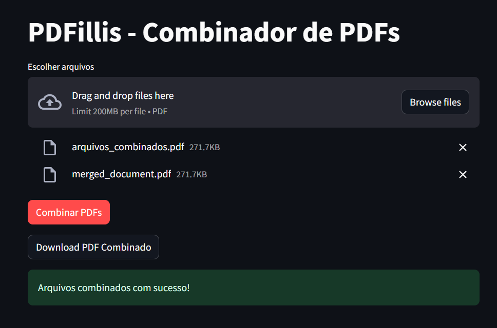

# PDFillis

A PDF Merge tool built with PyMuPDF and Streamlit.

This tool allows you to select multiple PDF files and combine them into a single PDF file. The merged PDF will maintain the order in which the files were selected.

## Features
- Upload multiple PDF files simultaneously
- Preview of selected files
- Download the merged PDF file
- Simple and intuitive web interface



## Running the App locally

You must have Python installed on your machine. This app was developed using `Python 3.11`, but it should be compatible with other Python 3.x versions.

1. After cloning this repo or downloading the ZIP file, install the dependencies:
    ```shell
    pip install -r requirements.txt
    ```
    This will install the required packages: `PyMuPDF` and `streamlit`.

2. To run the App:
    ```shell
    streamlit run main.py
    ```
    The app will open in your default web browser.

## Current Features
- Upload multiple PDF files at once
- Combine PDFs with a single click
- Download the merged PDF file
- Visual feedback for successful operations and errors
