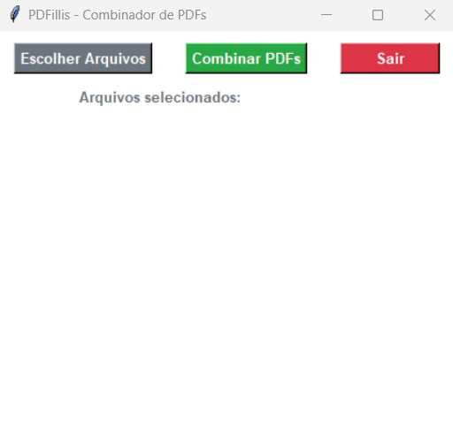
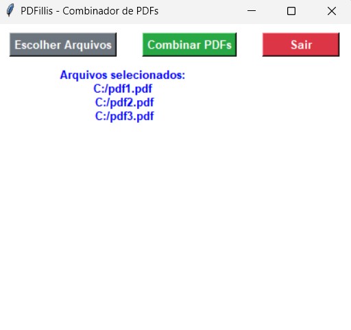
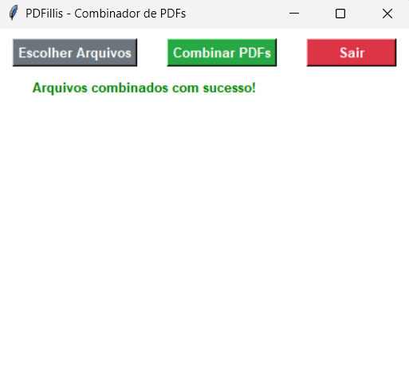

# PDFillis

A PDF Merge tool build with PyMuPDF and Tkinter.

This tool allows you to select the PDF files you want to merge and combine them into a single PDF file, in the same order the files were selected.

## Current Features
- The user can select only PDF files to be merged
- The user can select where the merged file will be saved





## Running the App locally
You must have Python installed on your machine, since this App was created using the `Python 3.11`. To run it in other Python you should check the compatibility.

1. After cloning this repo or downloading the ZIP file with this repo code, you must run:
    ```shell
    pip install -r requirements.txt
    ```
    to install the project dependencies, which has only `PyMuPDF`.

2. To run the App, you just need to call the ```main.py``` file:
    ```shell
    python main.py
    ```


## Next Features
- Allow the user to unselect PDF files
- Allow the user to change the order of the selected PDF files
- Allow multiple files selection at once
- Exception handling
- Create a `.exe` file, so the user doesn't need to have Python installed to run the App